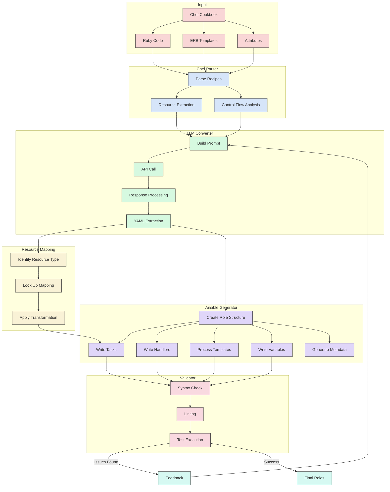
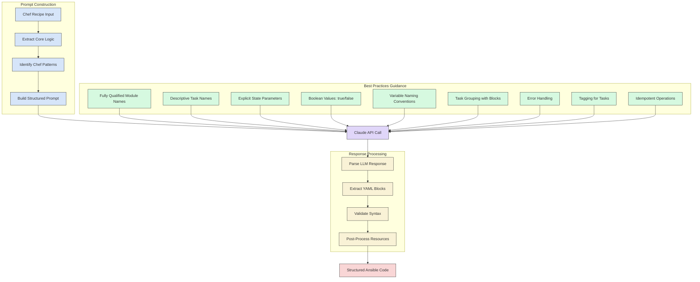

<p align="center">
  
</p>

# Chef to Ansible Converter

## Workflow Diagrams

### High-Level Conversion Pipeline

```mermaid
flowchart LR
    subgraph "Input" [Chef Input]
        A[Chef Repository] --> B[Chef Cookbooks]
        B --> B1[Recipes]
        B --> B2[Templates]
        B --> B3[Attributes]
        B --> B4[Libraries]
    end
    
    subgraph "Parsing" [Chef Parser]
        C[chef_parser.py] --> C1[Extract Resources]
        C --> C2[Parse Templates]
        C --> C3[Extract Attributes]
        C --> C4[Identify Custom Resources]
    end
    
    subgraph "Conversion" [LLM Conversion]
        D[llm_converter.py] --> D1[Claude API]
        D1 --> D2[Prompt Engineering]
        D2 --> D3[Ansible Code Generation]
        D --> D4[Custom Resource Handling]
    end
    
    subgraph "Mapping" [Resource Mapping]
        G[resource_mapping.py] --> G1[Standard Resources]
        G --> G2[Custom Resources]
        G --> G3[Complex Patterns]
    end
    
    subgraph "Generation" [Ansible Generator]
        L[ansible_generator.py] --> L1[Role Structure]
        L --> L2[Tasks]
        L --> L3[Handlers]
        L --> L4[Templates]
        L --> L5[Variables]
        L --> L6[Meta]
    end
    
    subgraph "Validation" [Validator]
        N[validator.py] --> N1[Syntax Check]
        N --> N2[ansible-lint]
        N --> N3[Test Execution]
        N --> N4[Feedback Generation]
    end
    
    B ==> C
    C ==> D
    C ==> G
    D ==> L
    G ==> L
    L ==> N
    N -->|Pass| O[Final Ansible Roles]
    N -->|Fail| P[Feedback Loop] --> D
    
    classDef chef fill:#e34c26,stroke:#333,stroke-width:1px,color:white
    classDef ansible fill:#1A6DB1,stroke:#333,stroke-width:1px,color:white
    classDef process fill:#4CAF50,stroke:#333,stroke-width:1px,color:white
    classDef validator fill:#FF9800,stroke:#333,stroke-width:1px,color:white
    classDef subgraph fill:#f5f5f5,stroke:#666,stroke-width:2px
    
    class A,B,B1,B2,B3,B4 chef
    class L1,L2,L3,L4,L5,L6,O ansible
    class C,C1,C2,C3,C4,D,D1,D2,D3,D4,G,G1,G2,G3 process
    class N,N1,N2,N3,N4,P validator
```

### Data Flow Between Components



### Chef to Ansible Conversion Process

The diagrams above illustrate the complete workflow for converting Chef cookbooks to Ansible roles, following Ansible best practices as outlined in the project requirements.

### LLM Prompt Engineering Approach



This diagram illustrates how the LLM prompt engineering approach incorporates Ansible best practices to ensure high-quality conversion results:

[](https://opensource.org/licenses/MIT)
[](https://github.com/joelio/chef-to-ansible-converter/actions)

A Python-based tool that leverages Anthropic's Claude API to automatically convert Chef cookbooks to Ansible playbooks and roles, following Ansible best practices.

**[Features](#features)** | **[Installation](#installation)** | **[Usage](#usage)** | **[Architecture](#architecture)** | **[Development](#development)** | **[Testing](#testing)** | **[Custom Resources](#custom-resource-handling)** | **[Metrics](#metrics-collection)** | **[License](#license)**

## Features

- **Repository Processing**: Clone and process Chef repositories
- **Cookbook Parsing**: Extract and understand Chef cookbook structures and recipes
- **Intelligent Conversion**: Transform Chef code to Ansible using Anthropic's Claude API
- **Ansible Generation**: Create properly formatted Ansible playbooks and roles
- **Validation**: Verify generated Ansible code with ansible-lint
- **Template Conversion**: Convert ERB templates to Jinja2 templates
- **Custom Resource Handling**: Map Chef custom resources to Ansible modules
- **Web UI**: Optional web interface for easy conversion
- **Comprehensive Logging**: Detailed logging for better debugging
- **Metrics Collection**: Track conversion quality and improvements

## Security Notice

⚠️ **IMPORTANT**: Do not use this tool with repositories containing sensitive information, credentials, or proprietary code. All code submitted for conversion is processed through external API services and may be stored or logged. Use only with non-sensitive, public, or test repositories.

## Installation

### Prerequisites

- Python 3.8+
- Git
- Anthropic API key (Claude API)
- Ansible (for validation, optional)
- ansible-lint (for validation, optional)

### Setup

1. Clone the repository:
   ```bash
   git clone https://github.com/joelio/chef-to-ansible-converter.git
   cd chef-to-ansible-converter
   ```

2. Install dependencies:
   ```bash
   pip install -r requirements.txt
   ```

3. Set up environment variables:
   ```bash
   cp .env.example .env
   # Edit .env to add your Anthropic API key
   ```

### Docker Installation

Alternatively, you can use Docker:

```bash
# Build the Docker image
make build

# Or manually
docker build -t chef-to-ansible-converter .
```

## Usage

### Command Line Interface

```bash
# Basic usage
python cli.py <chef-repo-path> --output <output-directory> --api-key <your-api-key>

# Using environment variable for API key
export ANTHROPIC_API_KEY=your-api-key
python cli.py <chef-repo-path> --output <output-directory>

# With validation
python cli.py <chef-repo-path> --output <output-directory> --validate

# With verbose logging
python cli.py <chef-repo-path> --output <output-directory> --log-level DEBUG

# With custom resource mapping
python cli.py <chef-repo-path> --output <output-directory> --resource-mapping ./my_mappings.json
```

### Using Makefile

The project includes a Makefile that simplifies common operations, especially when using Docker:

```bash
# Show all available commands
make help

# Build the Docker image
make build

# Convert Chef cookbooks to Ansible roles
make convert CHEF_REPO_PATH=./my-chef-repo OUTPUT_PATH=./my-ansible

# Validate generated Ansible roles
make validate OUTPUT_PATH=./my-ansible

# Start the web UI
make web

# Run tests on a sample repository
make test

# Collect metrics on conversion quality
make metrics

# Clean up temporary files and directories
make clean
```

Environment variables can be used to configure the conversion process:

```bash
# Set the Anthropic API key
export ANTHROPIC_API_KEY=your_api_key

# Set the model to use
export MODEL=claude-3-7-sonnet-20250219

# Set the log level
export LOG_LEVEL=DEBUG

# Run conversion with the configured environment
make convert CHEF_REPO_PATH=./my-chef-repo OUTPUT_PATH=./my-ansible
```

### Web UI

The converter also includes a web-based user interface for easier use:

```bash
# Start the web UI
make web
```

Then open your browser to http://localhost:5000

## Architecture

The Chef to Ansible Converter follows a pipeline architecture that transforms Chef cookbooks into Ansible roles through several specialized components:

### Conversion Workflow

1. **Chef Input & Repository Handler** (`repo_handler.py`):
   - Clones Chef repositories or processes local cookbook directories
   - Organizes cookbook files for parsing
   - Handles Git operations and temporary file management

2. **Chef Parser** (`chef_parser.py`):
   - Extracts resources, templates, attributes, and libraries from Chef code
   - Identifies recipe structures, dependencies, and cookbook metadata
   - Parses Ruby code to understand Chef-specific patterns and constructs
   - Organizes parsed data into structured format for conversion

3. **LLM Conversion Engine** (`llm_converter.py`):
   - Core component that transforms Chef code to Ansible using Claude API
   - Applies prompt engineering with Ansible best practices guidance
   - Handles context management for large cookbooks
   - Processes Chef-specific patterns and translates them to Ansible equivalents
   - Implements retry logic and error handling for API interactions

4. **Resource Mapping** (`resource_mapping.py`):
   - Maps Chef custom resources to Ansible modules
   - Handles Chef-specific resources that don't have direct Ansible equivalents
   - Provides extensible mapping system for organization-specific resources
   - Transforms complex Chef resources into equivalent Ansible task sequences

5. **Ansible Generator** (`ansible_generator.py`):
   - Creates properly structured Ansible roles following best practices
   - Generates tasks, handlers, templates, variables, and metadata
   - Organizes converted code into proper Ansible directory structure
   - Implements Ansible-specific optimizations and patterns
   - Ensures generated code follows Ansible conventions

6. **Validation Engine** (`validator.py`):
   - Ensures generated Ansible code is syntactically correct
   - Runs ansible-lint to check for best practices and potential issues
   - Performs test execution in isolated environments
   - Generates validation reports with improvement suggestions

7. **Supporting Components**:
   - **Logger** (`logger.py`): Provides structured logging throughout the application
   - **Configuration** (`config.py`): Manages application settings and API credentials
   - **CLI Interface** (`cli.py`): Command-line interface for the converter
   - **Web UI** (`web/app.py`): Optional web interface for easier use

### Data Flow

The conversion process follows this data flow:

1. Chef cookbooks are parsed into structured data representations
2. Structured data is transformed into prompts for the LLM
3. LLM generates Ansible code based on the Chef input
4. Custom resources are processed through the mapping system
5. Ansible code is organized into proper role structure
6. Generated roles are validated and tested
7. Final output is delivered as Ansible roles and playbooks

## Environment Variables

The following environment variables can be used to configure the tool:

- `ANTHROPIC_API_KEY`: Your Anthropic API key for Claude
- `ANTHROPIC_MODEL`: Model to use (default: claude-3-7-sonnet-20250219)
- `CHEF_TO_ANSIBLE_LOG_LEVEL`: Set logging level (DEBUG, INFO, WARNING, ERROR)
- `CHEF_TO_ANSIBLE_LOG_FILE`: Path to log file (if not set, logs to console only)
- `CHEF_TO_ANSIBLE_RESOURCE_MAPPING`: Path to custom resource mapping JSON file

## Development

### Project Structure

```
chef-to-ansible-converter/
├── src/                      # Source code
│   ├── ansible_generator.py  # Generates Ansible roles
│   ├── chef_parser.py        # Parses Chef cookbooks
│   ├── cli.py                # Command-line interface
│   ├── config.py             # Configuration handling
│   ├── llm_converter.py      # LLM conversion logic
│   ├── logger.py             # Logging setup
│   ├── repo_handler.py       # Git repository handling
│   ├── resource_mapping.py   # Custom resource mapping
│   └── validator.py          # Ansible validation
├── tests/                    # Test suite
├── config/                   # Configuration files
│   └── resource_mappings.json # Default resource mappings
├── examples/                 # Example Chef cookbooks
├── web/                      # Web UI
├── .github/workflows/        # GitHub Actions
├── requirements.txt          # Python dependencies
├── Dockerfile                # Docker configuration
├── Makefile                  # Build and run commands
└── README.md                 # This file
```

### Setting Up Development Environment

1. Create a virtual environment:
   ```bash
   python -m venv venv
   source venv/bin/activate  # On Windows: venv\Scripts\activate
   ```

2. Install development dependencies:
   ```bash
   pip install -r requirements.txt
   ```

3. Set up pre-commit hooks:
   ```bash
   pre-commit install
   ```

## Testing

The project includes a comprehensive test suite:

```bash
# Run all tests
python -m pytest

# Run tests with coverage
python -m pytest --cov=src

# Run specific test modules
python -m pytest tests/test_resource_mapping.py
```

### Test Structure

- `tests/test_cli.py`: Tests for the command-line interface
- `tests/test_chef_parser.py`: Tests for Chef cookbook parsing
- `tests/test_llm_converter.py`: Tests for the LLM conversion engine
- `tests/test_resource_mapping.py`: Tests for custom resource mapping
- `tests/test_validator.py`: Tests for Ansible validation
- `tests/test_custom_resource_handling.py`: Tests for custom resource handling
- `tests/test_custom_resource_integration.py`: Integration tests for custom resources

## Custom Resource Handling

The converter includes a powerful custom resource mapping system that can automatically translate Chef custom resources to their Ansible equivalents.

### Built-in Resource Mappings

The system comes with mappings for common custom resources:

- **Database Resources**: mysql_database, postgresql_database
- **Web Server Resources**: apache2_site, nginx_site
- **System Resources**: cron_job, systemd_unit
- **Container Resources**: docker_container
- **Cloud Resources**: aws_s3_bucket, kubernetes_deployment
- **Windows Resources**: windows_feature

### Customizable Mappings

You can define your own mappings in a JSON configuration file:

```json
{
  "my_custom_resource": {
    "ansible_module": "namespace.collection.module",
    "property_mapping": {
      "chef_property": "ansible_parameter",
      "value_mapping": {
        "property_name": {"chef_value": "ansible_value"}
      }
    }
  }
}
```

### Usage

```bash
# Use the default resource mappings
make convert CHEF_REPO_PATH=./my-chef-repo

# Use a custom resource mapping file
make convert CHEF_REPO_PATH=./my-chef-repo RESOURCE_MAPPING=./my_mappings.json

# Or with CLI
python cli.py ./my-chef-repo --output ./my-ansible --resource-mapping ./my_mappings.json
```

### How It Works

1. The LLM identifies custom resources in Chef code and marks them with specific patterns
2. The post-processor extracts resource type and data from these placeholders
3. The resource mapper applies appropriate mappings from the registry
4. The converter generates proper Ansible tasks with the correct modules and parameters

### Testing Custom Resources

You can test the custom resource handling functionality:

```bash
# Run unit tests for resource mapping
python -m pytest tests/test_resource_mapping.py

# Run tests for LLM integration
python -m pytest tests/test_custom_resource_handling.py

# Run end-to-end conversion tests
python -m pytest tests/test_custom_resource_integration.py

# Run all custom resource tests with coverage
python -m pytest tests/test_resource_mapping.py tests/test_custom_resource_handling.py tests/test_custom_resource_integration.py --cov=src.resource_mapping --cov=src.llm_converter
```

### Manual Testing

Create a test Chef recipe with custom resources:

```bash
mkdir -p test_chef_repo/cookbooks/test/recipes
cat > test_chef_repo/cookbooks/test/recipes/default.rb << 'EOF'
mysql_database 'myapp' do
  database_name 'myapp_production'
  connection host: 'localhost'
  user 'db_admin'
  password 'secure_password'
  action :create
end
EOF

# Run the converter
make convert CHEF_REPO_PATH=./test_chef_repo OUTPUT_PATH=./test_output

# Examine the generated Ansible role
cat test_output/test/tasks/main.yml
```

## Metrics Collection

The converter includes a metrics collection system that tracks conversion quality and generates visualizations:

```bash
# Run metrics collection
make metrics
```

This will:
1. Convert sample Chef cookbooks to Ansible roles
2. Analyze the conversion quality
3. Generate metrics on compliance with Ansible best practices
4. Create charts and visualizations

### Metrics Dashboard

The metrics are available on the GitHub Pages site:
https://joelio.github.io/chef-to-ansible-converter/metrics/

### Available Metrics

- **FQCN Compliance**: Use of Fully Qualified Collection Names
- **Task Name Capitalization**: Proper capitalization in task names
- **Boolean Values**: Use of true/false instead of yes/no
- **Variable Definition**: Proper definition of variables

## Conversion Results

We've conducted extensive testing of the Chef to Ansible converter using multiple test harnesses and repositories. Here's what we found:

### Successful Conversions

The converter successfully handles:

1. **Basic Chef Resources**: 
   - package → ansible.builtin.package
   - service → ansible.builtin.service
   - template → ansible.builtin.template
   - file → ansible.builtin.file
   - directory → ansible.builtin.file with state: directory

2. **ERB to Jinja2 Conversion**: 
   - Variable substitution: `<%= node['attr'] %>` → `{{ attr }}`
   - Conditionals: `<% if ... %>` → ``
   - Loops: `<% each do |item| %>` → ``

3. **Chef Notifications**: 
   - notifies → notify
   - subscribes → handlers

4. **Chef Attributes**: 
   - Node attributes → Ansible variables
   - Default attributes → defaults/main.yml

5. **Custom Resources**:
   - Database resources → community.mysql.mysql_db, etc.
   - Web server resources → community.general.nginx_site, etc.
   - System resources → ansible.builtin.systemd, etc.

### Real-World Testing

We tested the converter against these real-world Chef repositories:

1. **chef-solo-hello-world**: Simple web application (3 tasks, 2 handlers, 2 templates)
2. **iptables**: Network firewall configuration (73 tasks, 7 handlers, 4 templates)
3. **auditd**: Security auditing (17 tasks, 4 handlers, 7 templates)

### Challenges and Areas for Improvement

1. **Complex Ruby Logic**: 
   - Ruby blocks and complex conditionals need more sophisticated conversion
   - Nested logic structures sometimes lose their original intent

2. **Platform-Specific Code**: 
   - OS-specific configurations need better mapping to Ansible facts
   - Some platform detection logic doesn't translate cleanly

## License

This project is licensed under the MIT License - see the [LICENSE](LICENSE) file for details.
