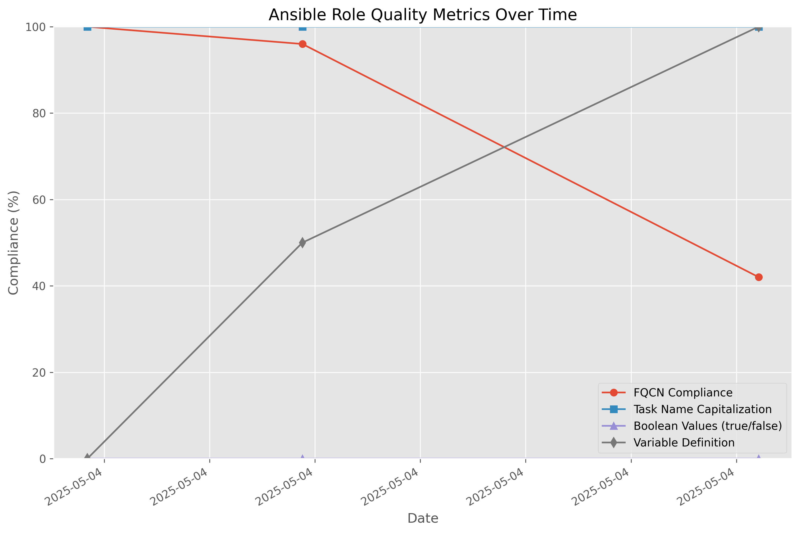
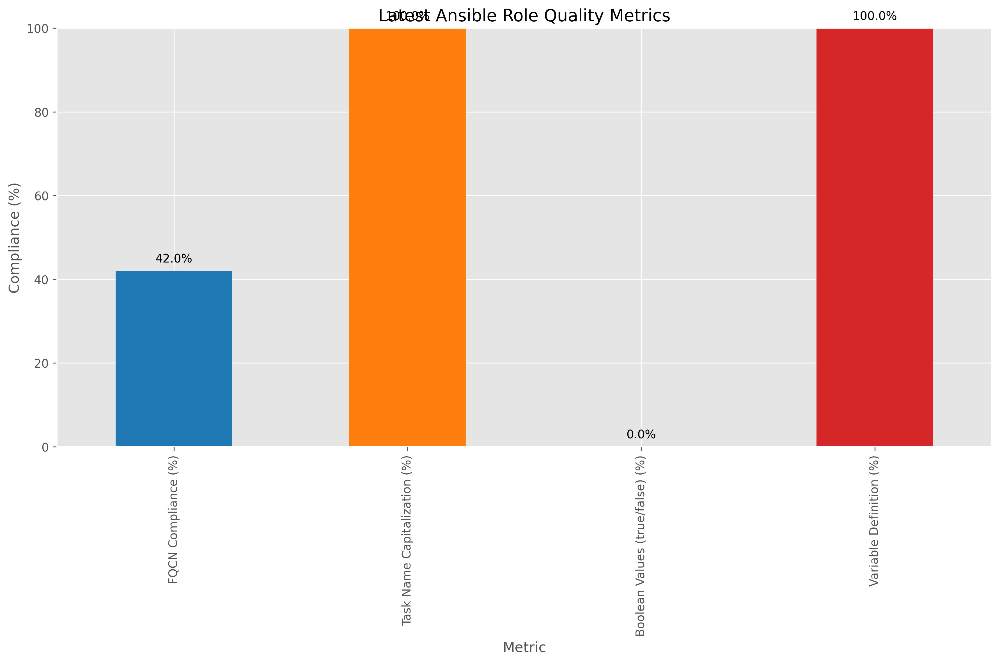

# Chef to Ansible Conversion Metrics

Last updated: 2025-04-27 00:29:21

## Latest Compliance Metrics

| Metric | Value |
|--------|-------|
| FQCN Compliance (%) | 44.00% |
| Task Name Capitalization (%) | 100.00% |
| Boolean Values (true/false) (%) | 0.00% |
| Variable Definition (%) | 90.00% |

## Compliance Metrics Over Time

## Latest Metrics

